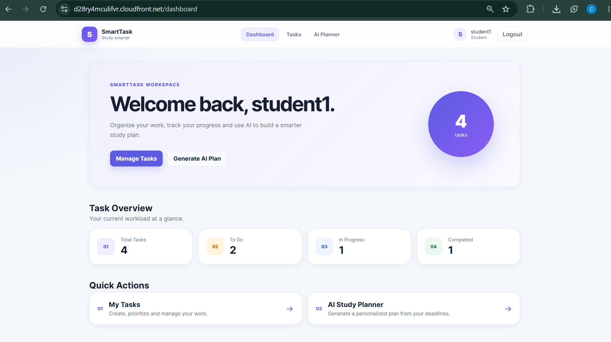
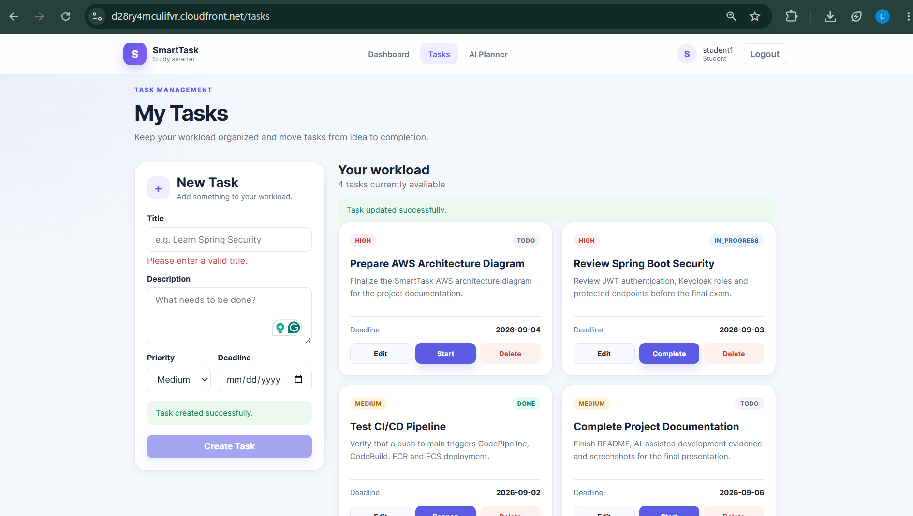
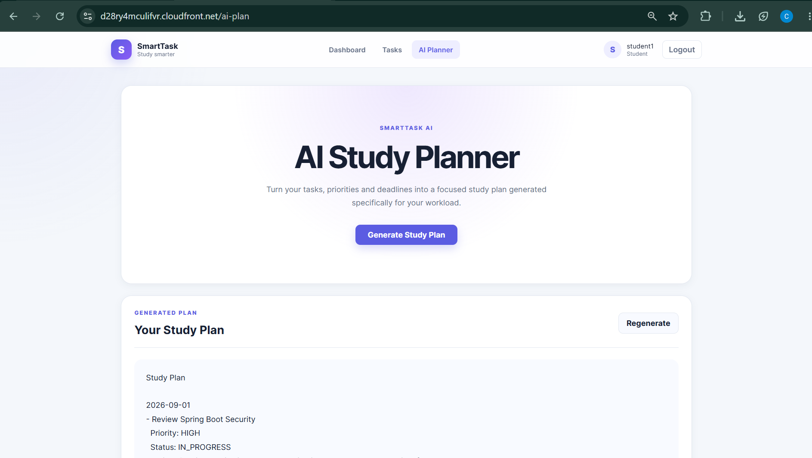
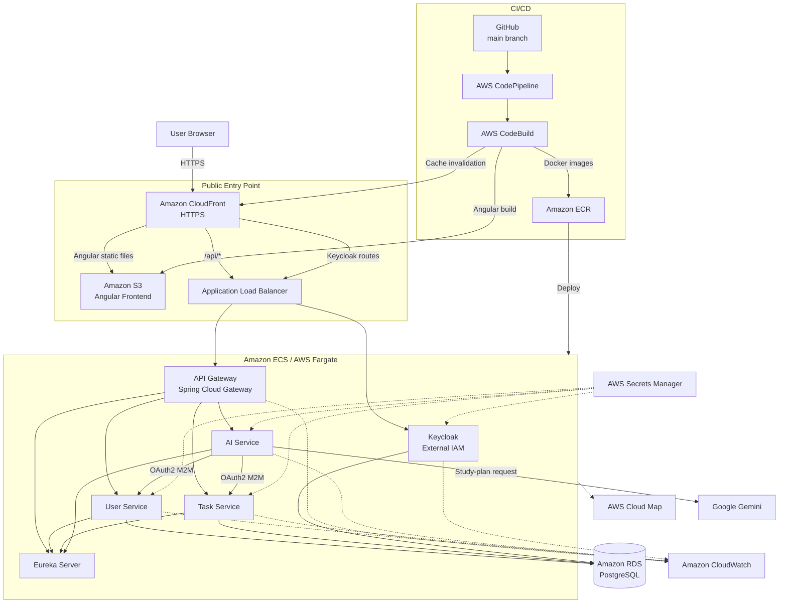
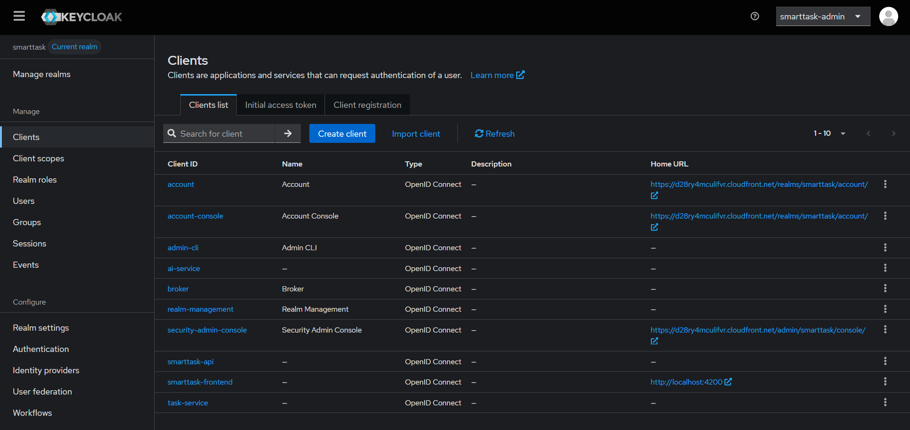
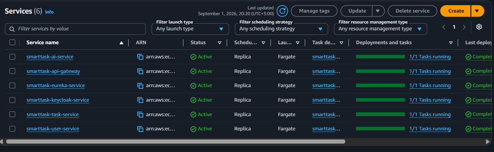
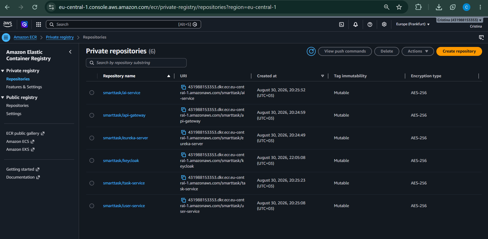
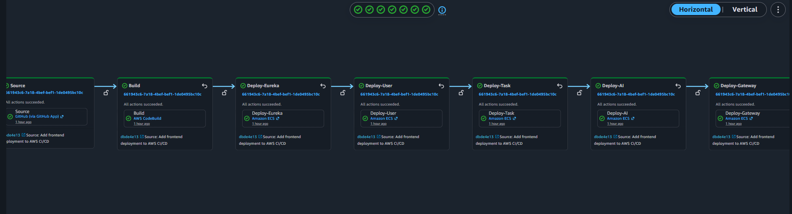

# SmartTask

SmartTask is a cloud-native task management and AI study-planning application built with **Spring Boot**, **Spring Cloud**, **Angular**, **Keycloak**, **Docker**, and **AWS**.

The project follows microservices principles and demonstrates service discovery, centralized API routing, OAuth2/OpenID Connect security, machine-to-machine authentication, PostgreSQL persistence, AI integration, containerized deployment, and automated AWS CI/CD.

## Live Demo

**Application:** https://d28ry4mculifvr.cloudfront.net

> The public application is served through Amazon CloudFront. Availability depends on the AWS demo infrastructure being active.

## Project Highlights

- Spring Boot + Spring Cloud microservices
- Netflix Eureka service discovery
- Spring Cloud API Gateway
- PostgreSQL on Amazon RDS
- Keycloak external IAM
- OAuth2 / OpenID Connect / JWT
- Authorization Code Flow with PKCE for Angular
- OAuth2 Client Credentials for machine-to-machine communication
- Role-based authorization
- Backend task ownership validation
- AI Study Planner powered by Google Gemini through Spring AI
- Docker + Docker Compose
- Amazon ECS / AWS Fargate deployment
- Amazon ECR container registry
- Amazon S3 + CloudFront frontend hosting
- AWS Secrets Manager
- Amazon CloudWatch
- AWS Cloud Map
- AWS CodePipeline + CodeBuild continuous integration and deployment

---

## Application Screenshots

### Dashboard

The authenticated student dashboard summarizes the current workload and provides quick access to task management and the AI Study Planner.



### Task Management

Students can create, prioritize, update, complete, and delete their own tasks. The screenshot also demonstrates multiple priorities and task states.



### AI Study Planner

The AI feature generates a study plan from the authenticated student's current tasks, priorities, statuses, and deadlines.



---

## Architecture



More detailed diagrams and flows are available in:

- [AI-assisted architecture documentation](docs/ai/architecture-diagram.md)

---

## Microservices

| Component       |     Local port | Responsibility                                     |
| --------------- | -------------: | -------------------------------------------------- |
| `eureka-server` |         `8761` | Service discovery                                  |
| `api-gateway`   |         `8080` | Central API entry point and routing                |
| `user-service`  |         `8081` | Application users and Keycloak-to-database mapping |
| `task-service`  |         `8082` | Task CRUD and ownership enforcement                |
| `ai-service`    |         `8083` | AI study-plan generation                           |
| Keycloak        |         `8180` | External IAM, authentication and authorization     |
| PostgreSQL      | `5433` on host | Local persistence through Docker                   |

The API Gateway exposes the main routes:

```text
/api/users/**  -> user-service
/api/tasks/**  -> task-service
/api/ai/**     -> ai-service
```

---

## Security

SmartTask uses **Keycloak** as an external IAM system.

### Browser authentication

The Angular frontend uses:

```text
OAuth2 / OpenID Connect
Authorization Code Flow
PKCE S256
```

The frontend client is public and does not store a client secret.

### Roles and access control

The project uses roles such as:

```text
STUDENT
ADMIN
AI_SERVICE
```

Spring Security converts Keycloak realm roles into Spring authorities and protects endpoints using method-level authorization such as `@PreAuthorize`.

### Machine-to-machine communication

The AI service accesses protected internal endpoints using OAuth2 Client Credentials.

```text
AI Service
    |
    | client_credentials
    v
Keycloak
    |
    | service JWT
    v
User Service / Task Service
```

This demonstrates machine-to-machine authentication separately from end-user authentication.

### Task ownership

Task ownership is enforced by the backend.

The browser does not decide which user owns a task. The application derives the current user from the validated JWT:

```text
JWT subject
   |
   v
User Service
   |
   v
Application User ID
   |
   v
Task ownership
```

Read, update, and delete operations verify ownership before accessing the task.

### Self-registration

Keycloak user registration is enabled for student accounts. New registrations receive the `STUDENT` role by default.

The application includes automatic user provisioning so that an authenticated Keycloak account can be mapped into the SmartTask application database without allowing the browser to choose its own identity.

### Secret management

Production secrets are not intentionally committed to the repository.

Sensitive values are supplied through environment variables and AWS Secrets Manager, including values such as:

```text
GEMINI_API_KEY
AI_SERVICE_CLIENT_SECRET
TASK_SERVICE_CLIENT_SECRET
KEYCLOAK_ADMIN_USERNAME
KEYCLOAK_ADMIN_PASSWORD
```

Sensitive local/runtime files are excluded from Git:

```text
.env
infrastructure/keycloak/data/
infrastructure/keycloak/export/smarttask-realm.json
```

### AWS network security

- Amazon RDS is private.
- Database access is restricted using Security Groups.
- Public browser traffic enters through HTTPS on CloudFront.
- CI/CD IAM permissions are scoped to the resources required by the pipeline.

More details:

- [AI-assisted security analysis](docs/ai/security-analysis.md)

### Keycloak evidence

The following screenshot shows the SmartTask Keycloak realm and application/service clients used for frontend authentication and service-to-service security.



---

## AI Feature

SmartTask contains an AI-powered **Study Planner** implemented through Spring AI and Google Gemini.

The flow is:

```text
Authenticated Student
        |
        v
Angular
        |
        v
API Gateway
        |
        v
AI Service
        |
        +--> resolve authenticated user
        |
        +--> retrieve the user's tasks
        |
        v
Google Gemini
        |
        v
Generated Study Plan
```

The AI feature uses real task data belonging to the authenticated user rather than a hardcoded prompt.

---

## AI-Assisted Development

- [Code generation](docs/ai/code-generation.md)
- [Code validation](docs/ai/code-validation.md)
- [Security analysis and vulnerability reduction](docs/ai/security-analysis.md)
- [Architecture diagram generation](docs/ai/architecture-diagram.md)

AI assistance was used for tasks including:

- Spring Security configuration
- OAuth2 Client Credentials configuration
- JWT and role handling
- task ownership review
- CORS debugging
- Eureka deployment debugging
- Docker and AWS configuration
- AWS CodeBuild configuration
- CI/CD pipeline design
- security review and secret-handling checks
- architecture documentation

AI-generated suggestions were reviewed, adapted, compiled, deployed, and validated against the running application.

---

## AWS Deployment

The production environment is deployed in AWS.

### Backend

The backend runs as Docker containers on **Amazon ECS with AWS Fargate**.

The ECS cluster contains the SmartTask services, including Eureka, API Gateway, User Service, Task Service, AI Service, and Keycloak.



### Container registry

Docker images are stored in **Amazon ECR**.



Pipeline-generated images use both:

```text
latest
<short Git commit SHA>
```

This makes it possible to associate a container image with the source revision that generated it.

### Database

The application uses **Amazon RDS PostgreSQL** for persistent data.

The database is deployed privately and access is controlled using Security Groups.

### Frontend

The Angular production build is stored in **Amazon S3** and served using **Amazon CloudFront** over HTTPS.

CloudFront is also used as the public browser-facing entry point.

### Observability and service discovery

The AWS deployment also uses:

- Amazon CloudWatch for logs
- AWS Cloud Map for service/network discovery
- Netflix Eureka for application-level service discovery
- Application Load Balancer for backend routing

---

## CI/CD

SmartTask uses an automated AWS CI/CD pipeline.

A push to the `main` branch triggers:

```text
GitHub
   |
   v
AWS CodePipeline
   |
   v
AWS CodeBuild
   |
   +--> build Spring Boot services
   +--> build Angular frontend
   +--> build Docker images
   +--> push Docker images to Amazon ECR
   +--> upload Angular build to Amazon S3
   +--> invalidate CloudFront cache
   +--> generate ECS deployment definitions
   |
   v
Automatic ECS deployment
   |
   +--> Eureka Server
   +--> User Service
   +--> Task Service
   +--> AI Service
   +--> API Gateway
```

### Successful pipeline execution

The following screenshot shows a complete successful execution from source through all backend deployment stages.



The main build definition is stored in:

```text
buildspec.yml
```

---

## Technology Stack

### Backend

- Java 21
- Spring Boot
- Spring Cloud
- Spring Cloud Gateway Server Web MVC
- Netflix Eureka
- Spring Security
- OAuth2 Resource Server
- OAuth2 Client
- Spring Data JPA
- PostgreSQL
- Spring AI
- Maven

### Frontend

- Angular
- TypeScript
- `keycloak-js`
- Angular HttpClient
- JWT bearer-token interceptor

### Security

- Keycloak
- OAuth2
- OpenID Connect
- JWT
- PKCE
- role-based access control
- machine-to-machine Client Credentials

### DevOps / Cloud

- Docker
- Docker Compose
- Amazon ECS
- AWS Fargate
- Amazon ECR
- Amazon RDS
- Amazon S3
- Amazon CloudFront
- Application Load Balancer
- AWS Secrets Manager
- Amazon CloudWatch
- AWS Cloud Map
- AWS CodePipeline
- AWS CodeBuild

### AI

- Spring AI
- Google Gemini

---

## Project Structure

```text
smarttask/
├── backend/
│   ├── eureka-server/
│   ├── api-gateway/
│   ├── user-service/
│   ├── task-service/
│   └── ai-service/
│
├── frontend/
│
├── infrastructure/
│   └── keycloak/
│
├── docs/
│   ├── ai/
│   │   ├── code-generation.md
│   │   ├── code-validation.md
│   │   ├── security-analysis.md
│   │   └── architecture-diagram.md
│   │
│   └── screenshots/
│       ├── dashboard.png
│       ├── tasks.png
│       ├── ai-study-planner.png
│       ├── keycloak-clients.png
│       ├── codepipeline-success.png
│       ├── ecs-services.png
│       └── ecr-repositories.png
│
├── .env.example
├── .gitignore
├── buildspec.yml
├── docker-compose.yml
└── README.md
```

---

## Local Development

### Requirements

- Java 21
- Maven or Maven Wrapper
- Node.js 22
- npm
- Docker Desktop
- Git

### Environment variables

Use `.env.example` as a template and keep the real `.env` file outside Git.

Example placeholder configuration:

```env
POSTGRES_DB=smarttask
POSTGRES_USER=smarttask
POSTGRES_PASSWORD=change-me

KEYCLOAK_ADMIN_USERNAME=admin
KEYCLOAK_ADMIN_PASSWORD=change-me

TASK_SERVICE_CLIENT_SECRET=your-task-service-client-secret
AI_SERVICE_CLIENT_SECRET=your-ai-service-client-secret

GEMINI_API_KEY=your-gemini-api-key
```

### Start local infrastructure

```bash
docker compose up -d
```

Local endpoints:

```text
Eureka       http://localhost:8761
API Gateway  http://localhost:8080
User Service http://localhost:8081
Task Service http://localhost:8082
AI Service   http://localhost:8083
Keycloak     http://localhost:8180
Angular      http://localhost:4200
PostgreSQL   localhost:5433
```

### Start a backend service

Example on Windows:

```powershell
cd backend\eureka-server
.\mvnw.cmd spring-boot:run
```

Repeat for the required backend services.

### Start Angular

```powershell
cd frontend
npm install
npm start
```

---

## Main API Endpoints

### Users

```text
POST   /api/users/me
GET    /api/users
GET    /api/users/{id}
POST   /api/users
DELETE /api/users/{id}
```

Administrative endpoints are protected using the `ADMIN` role.

### Tasks

```text
GET    /api/tasks
GET    /api/tasks/{id}
POST   /api/tasks
PUT    /api/tasks/{id}
DELETE /api/tasks/{id}
```

Task operations use the authenticated user's identity and enforce ownership.

### AI

```text
POST /api/ai/study-plan
```

---

## Additional Evidence

For an examiner or reviewer, the most useful sections are:

1. [Live application](https://d28ry4mculifvr.cloudfront.net)
2. [AI-assisted code generation](docs/ai/code-generation.md)
3. [AI-assisted code validation](docs/ai/code-validation.md)
4. [AI-assisted security analysis](docs/ai/security-analysis.md)
5. [Architecture diagrams](docs/ai/architecture-diagram.md)
6. [Successful AWS CI/CD pipeline](#successful-pipeline-execution)

---

## Future Improvements

Possible improvements outside the current exam scope:

- larger automated unit/integration/security test suite
- additional administrator functionality
- custom domain and certificate management
- Infrastructure as Code using AWS CDK
- production deployment approval gates
- additional CloudWatch alarms and dashboards

---

## Author

SmartTask was developed as a personal project demonstrating practical knowledge of:

- Spring Boot
- Spring Cloud
- microservices
- cybersecurity
- OAuth2 / OpenID Connect
- Docker
- AWS architecture
- AWS CI/CD
- AI integration
- AI-assisted software development
