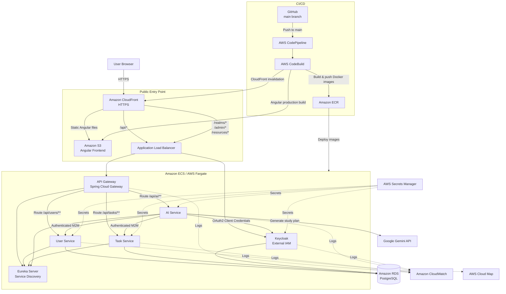
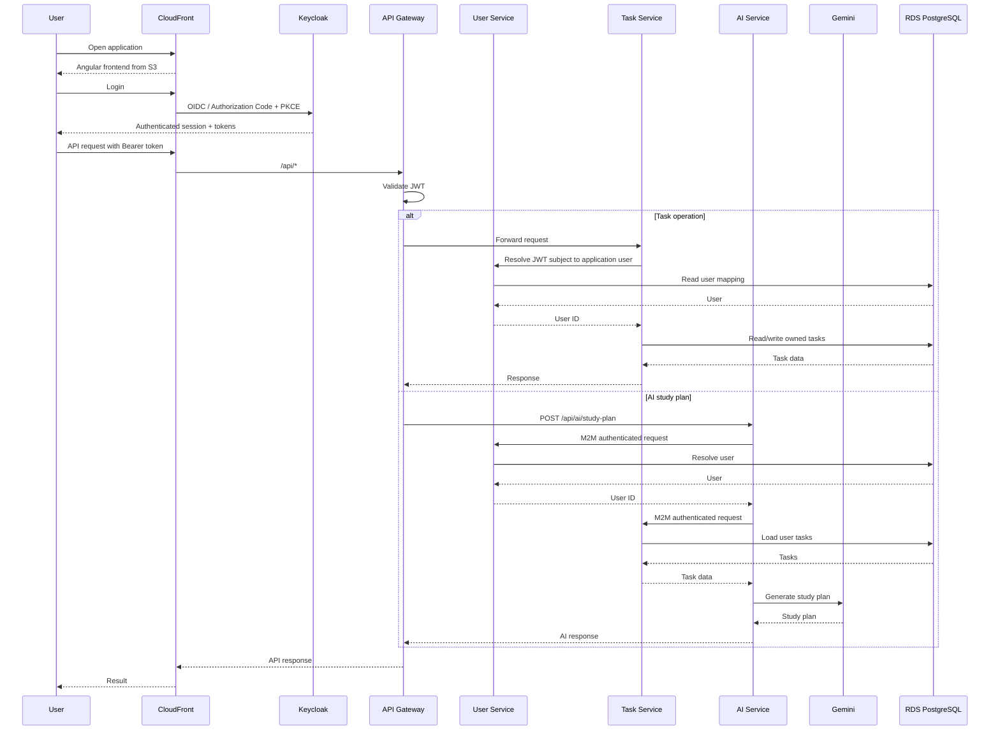
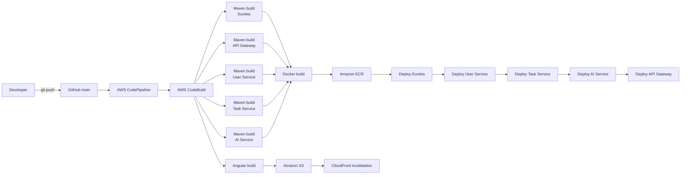
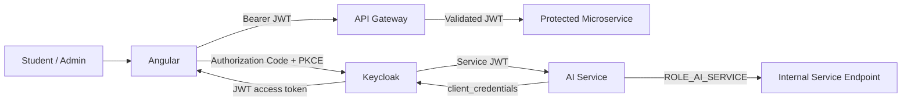

# SmartTask Architecture Diagram

## AI-Assisted Architecture Documentation

This document contains the final SmartTask architecture diagram created with AI assistance.

The diagram combines the main application flow, security components, AWS services, AI integration, and CI/CD pipeline.

## Final Architecture

## Runtime Request Flow

## CI/CD Flow

## Security Flow

## Main Components

### Application

- Angular frontend
- API Gateway
- Eureka Server
- User Service
- Task Service
- AI Service
- Keycloak
- PostgreSQL
- Google Gemini

### AWS Services

- Amazon ECS
- AWS Fargate
- Amazon ECR
- Amazon RDS
- Amazon S3
- Amazon CloudFront
- Application Load Balancer
- AWS Secrets Manager
- Amazon CloudWatch
- AWS Cloud Map
- AWS CodePipeline
- AWS CodeBuild

## Notes

- CloudFront is the public HTTPS entry point.
- Angular is hosted in a private S3 bucket and served through CloudFront.
- Backend services run as Docker containers on ECS Fargate.
- Keycloak provides external IAM, users, roles, OAuth2 and OpenID Connect.
- Eureka provides application-level service discovery.
- AWS Cloud Map is used in the AWS infrastructure for service discovery/network addressing.
- RDS PostgreSQL is private and protected by Security Groups.
- Sensitive deployment values are stored in AWS Secrets Manager.
- AI Service uses OAuth2 Client Credentials for machine-to-machine communication.
- The AI Study Planner uses Google Gemini.
- A push to the `main` branch triggers the complete AWS CI/CD pipeline.
